Data Viz Project
----------------

El siguiente repo es una guía para graficar y un portafolio de viz. El
data set utilizado tiene que ver con enfermedades del corazón y puede
ser encontrado en
[Kaggle](https://www.kaggle.com/ronitf/heart-disease-uci).

### Breve descripción de las variables:

-Age: Edad del paciente. INT

-Sex: Género del paciente. Booleano

-CP: Nivel de dolor en el pecho. INT

-Trestbps: Nivel presión en sangre. INT

-Chol: Nivel de Colesterol. INT

-Fbs: Nivel de azúcar en sangre. INT

-Thalach, Nivel máximo de HRV. INT

-Exang, Angina inducida al ejercicio. Booleano

-Oldpeak, Depresión del ST inducida por el ejercicio en relación con el
reposo. INT

------------------------------------------------------------------------

    library(tidyverse)
    library(ggplot2)
    library(stringr)
    library(dplyr)
    library(GGally)

    df <- read_csv("heart.csv")
    
    df$sex <- replace(df$sex, df$sex =="1", "Male")
    df$sex <- replace(df$sex, df$sex =="0", "Female")
    df$sex <- as.factor(df$sex)
    df$exang <- replace(df$exang, df$exang =="1", "Yes")
    df$exang <- replace(df$exang, df$exang =="0", "No")
    df$exang <- as.factor(df$exang)

#### Grafico de Barras Simple

    df  %>%
      ggplot(aes(x = sex, fill = sex)) + geom_bar(show.legend = F) + theme_minimal() + 
      ylab("Frecuencia") +
      xlab("")

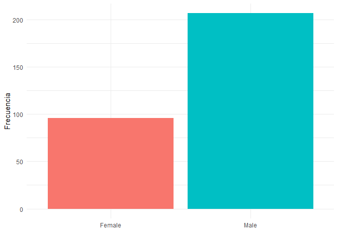

#### Grafico de barras con dos variables categóricas

    df  %>%
      ggplot(aes(x = sex, fill = sex)) + geom_bar(show.legend = T) + 
      facet_wrap(~exang) +
      theme_minimal() + 
      ylab("Frecuencia") +
      xlab("") +
      ggtitle("Frecuencia del género en función de la presencia de angina inducida por ejercicio")

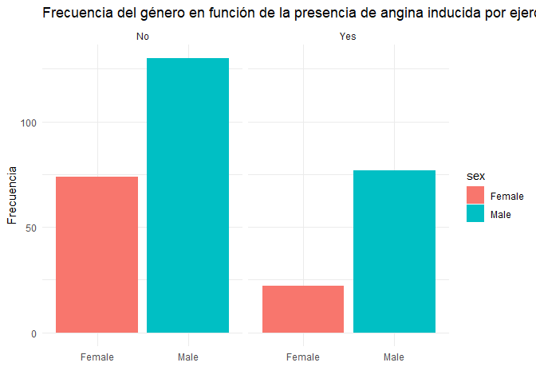

#### Box plot

    df %>%
    ggplot(aes(x = sex, y = trestbps, fill = sex, color = sex)) + 
      geom_boxplot(alpha = 0.75, show.legend = F) + 
      theme_minimal()

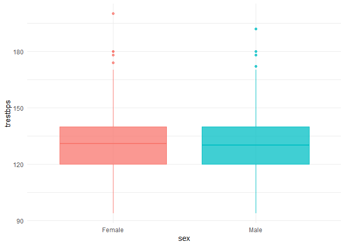

    ## Categorizamos la edad en 7 
    categorias <- c("20-29", "30-39", "40-49","50-59","60-69", "70-79")
    df$age.cut <- cut(df$age, breaks = c(20, 30, 40, 50, 60, 70, 80), labels = categorias)

#### Bar plot de varias categorias

    df  %>%
      ggplot(aes(x = age.cut, fill = sex)) + geom_bar(show.legend = T) + theme_minimal() + 
      ylab("Frecuencia") +
      xlab("Grupos Etarios")

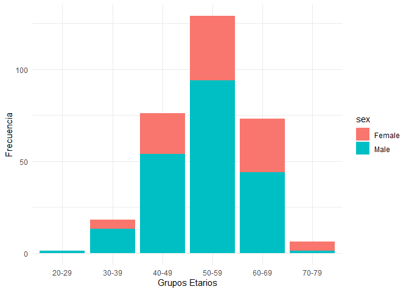

#### Boxplot de varias categorias

    df %>%
      ggplot(aes(x = age.cut, y = trestbps, color = age.cut, fill = age.cut)) + 
      geom_boxplot(alpha = 0.75, show.legend = F) + 
      theme_minimal()

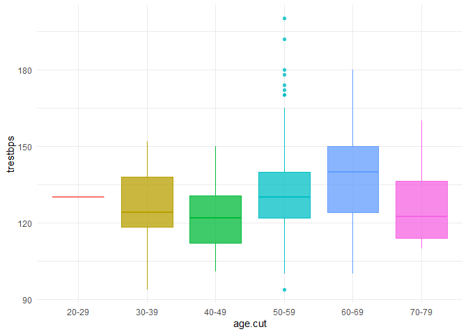

#### Boxplot con dos variables categoricas

    df %>%
      ggplot(aes(x = sex, y = chol, color = sex, fill = sex)) + 
      geom_boxplot(alpha = 0.75, show.legend = T) +
      facet_wrap(~exang) +
      theme_minimal() +
      ggtitle("Distribución del Nivel del Colesterol en función del sexo y de la presencia de Angina")

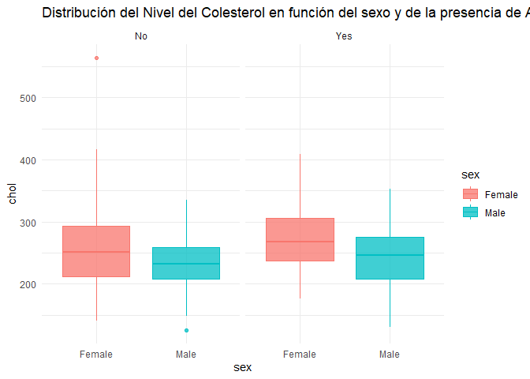

Muchos boxplots
---------------

    df %>%
      ggplot(aes(x = age.cut, y = trestbps, fill = sex, color = sex)) + 
      geom_boxplot(alpha = 0.75, show.legend = T) + 
      theme_minimal()

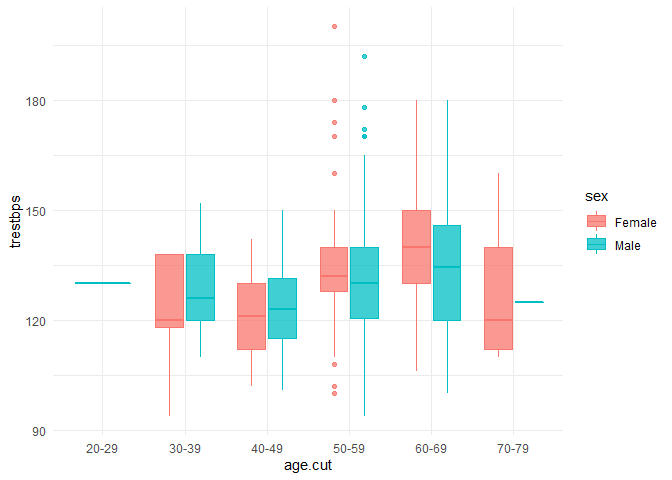

#### Muchos boxplots con las observaciones

    df %>%
      ggplot(aes(x = age.cut, y = trestbps, fill = sex, color = sex)) + 
      geom_jitter(aes(color=sex),alpha=0.2) +
      geom_boxplot(alpha = 0.75, show.legend = T) + 
      theme_minimal()

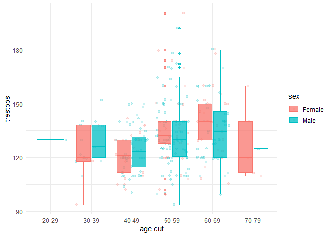

#### Muchos boxplots con una variable categorica

    df %>%
      ggplot(aes(x = age.cut, y = chol, fill = sex, color = sex)) + 
      facet_wrap(~sex) +
      geom_boxplot(alpha = 0.75, show.legend = F) + 
      theme_minimal()

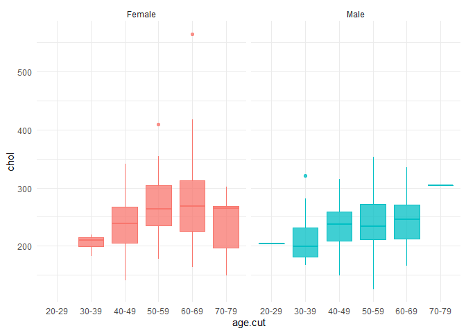

#### Hist

    df %>%
      ggplot(aes(x = trestbps)) +
      geom_histogram(alpha = 0.75, show.legend = F,  color = "#005CAB", fill = "#005CAB") + 
      theme_minimal()

    ## `stat_bin()` using `bins = 30`. Pick better value with `binwidth`.

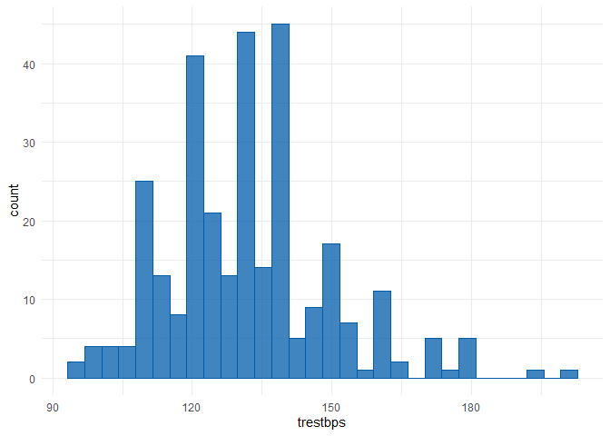

Hist con una variable categorica
--------------------------------

    df %>%
      ggplot(aes(x = trestbps, color = sex, fill = sex)) + facet_wrap(~sex) +
      geom_histogram(alpha = 0.75, show.legend = T) + 
      theme_minimal()

    ## `stat_bin()` using `bins = 30`. Pick better value with `binwidth`.

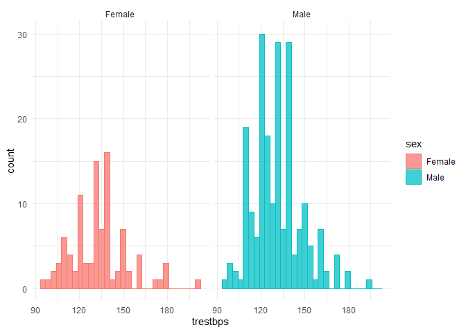

#### Scatterplot separado por una variable categorica

    df %>%
      ggplot(aes(x = trestbps,y = chol,fill = sex, color = sex)) + 
      geom_point(alpha = 0.75) +
      theme_minimal()

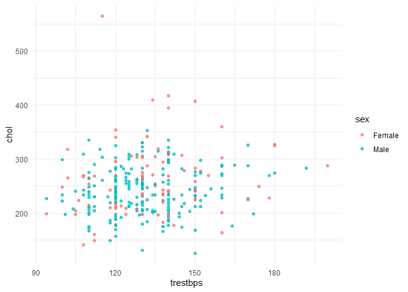

#### Scatterplot con la recta de Regresion

    df %>%
      ggplot(aes(x = trestbps,y = chol)) + 
      geom_point(alpha = 0.75, color = "#005CAB") + geom_smooth(method = "lm") +
      theme_minimal()

    ## `geom_smooth()` using formula 'y ~ x'

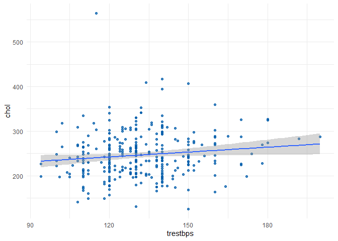

#### Scatterplot de 3 variables

    df %>%
      ggplot(aes(x = trestbps,y = thalach, color = cp, fill = cp)) + 
      geom_point(alpha = 0.75) + 
      theme_minimal()

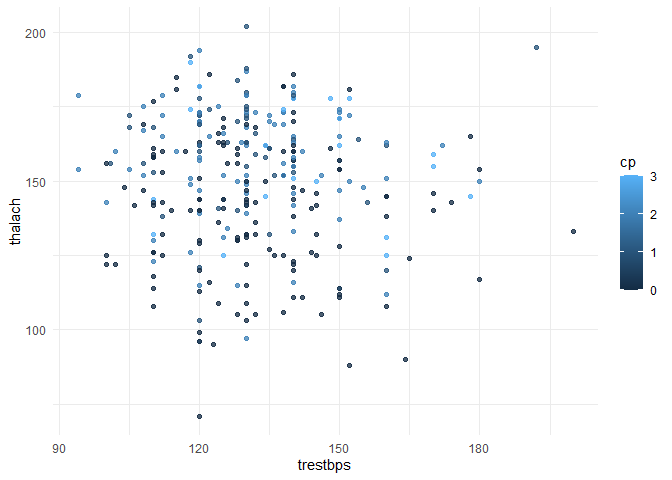

#### Scatterplot incluyendo una variable categorica

    df %>%
      ggplot(aes(x = thalach,y = age, color = exang, fill = exang)) + 
      geom_point(alpha = 0.75, show.legend = T) + facet_wrap(~exang) +
      theme_minimal()

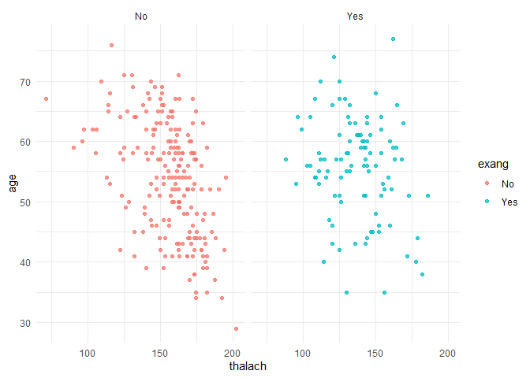

#### Scatterplot incluyendo una variable categorica y la recta de regresion

    df %>%
      ggplot(aes(x = thalach,y = age, color = exang, fill = exang)) + 
      geom_point(alpha = 0.75, show.legend = T) + facet_wrap(~exang) + 
      geom_smooth(method = "lm") +
      theme_minimal()

    ## `geom_smooth()` using formula 'y ~ x'

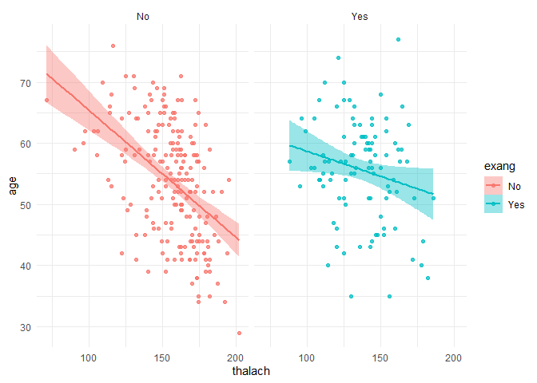

#### Heatmap

Para el heatmap primero calculamos la matriz de correlaciones

    matriz_corr <- df %>%
      select(age, cp, trestbps, chol,thalach, oldpeak) %>%
      cor(method = "pearson") %>%
      round(2)

    ggcorr(matriz_corr, midpoint = 0, low = "#9fd3de", mid = "#0087cd", high = "#006fbe", label = T)

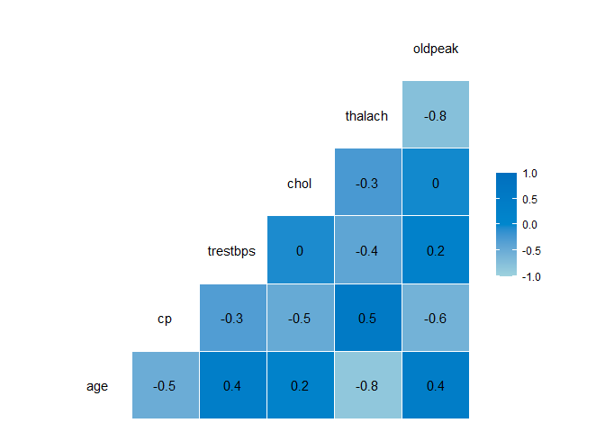
